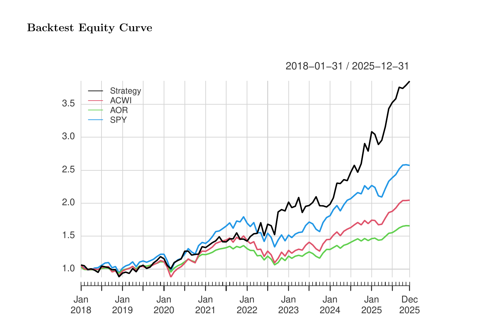

# Resilient Growth Opportunities Fund

### Multi-Asset Portfolio Strategy

A quantitative portfolio-construction project examining how constrained optimization, diversification, and risk attribution can be used to combine traditional and alternative assets.

The strategy allocates across U.S. financials, emerging markets, energy, gold, and Bitcoin, and evaluates historical performance relative to ACWI, AOR, and SPY.

## Strategy Overview

The portfolio was designed to pursue long-term growth while maintaining exposure to assets with different macroeconomic sensitivities.

| Asset                                     | Portfolio Role                                   | Weight |
| ----------------------------------------- | ------------------------------------------------ | -----: |
| JPMorgan Chase (`JPM`)                    | Primary U.S. equity and cyclical-growth exposure | 57.85% |
| SPDR Gold Shares (`GLD`)                  | Defensive real-asset and diversification sleeve  | 27.15% |
| ExxonMobil (`XOM`)                        | Energy and commodity-cycle exposure              |  5.00% |
| iShares MSCI Emerging Markets ETF (`EEM`) | Geographic and emerging-markets diversification  |  5.00% |
| Bitcoin (`BTC-USD`)                       | Capped alternative-asset exposure                |  5.00% |

The portfolio is long-only and fully invested. Minimum allocations preserve exposure across the selected asset universe, while Bitcoin is capped at 5% to limit the effect of its substantially higher volatility.

## Historical Performance

*Illustrative historical growth of $1 using rolling portfolio re-optimization, compared with ACWI, AOR, and SPY over the available backtest period.*

## Key Findings

**Return potential came with meaningful concentration risk.** JPM received the largest capital allocation and accounted for the majority of estimated portfolio risk, highlighting that equal asset count does not imply equal risk diversification.

**Gold provided capital-efficient diversification.** GLD represented more than one-quarter of the portfolio but contributed relatively little to total portfolio volatility because of its lower volatility and low correlation with equities.

**A small Bitcoin allocation still mattered.** Despite its 5% cap, Bitcoin made a material contribution to portfolio risk and return, demonstrating how high-volatility assets can influence portfolio behavior even at modest weights.

**The strategy should not be interpreted as a low-risk balanced portfolio.** It is better characterized as a concentrated, growth-oriented multi-asset strategy with defensive and alternative sleeves.

## Analytical Framework

The project uses monthly market data from 2016 through 2025 and applies:

* Constrained mean-variance optimization
* Efficient-frontier analysis
* Benchmark comparison against ACWI, AOR, and SPY
* Maximum drawdown and downside-risk analysis
* Marginal and percentage contribution to portfolio risk
* Rolling return, volatility, and Sharpe-ratio analysis
* Rolling portfolio re-optimization
* CAPM regression
* Historical bootstrap scenarios
* Correlation and return-distribution diagnostics

## Investment Interpretation

The project illustrates both the usefulness and limitations of quantitative optimization.

Optimization provides a disciplined framework for combining assets and evaluating trade-offs, but the resulting portfolio remains sensitive to:

* Historical return and covariance estimates
* The selected asset universe
* Position constraints
* The chosen estimation window
* Concentration in individual securities
* The unusually strong historical performance of Bitcoin

The portfolio should therefore be evaluated through risk contribution, drawdowns, weight stability, and economic judgment—not only headline returns or Sharpe ratios.

## Repository Contents

* [`paper/final-paper.pdf`](paper/final-paper.pdf) — Full research paper and exhibits
* [`executive-summary.md`](executive-summary.md) — Concise investment-oriented summary
* [`archive/original-final.Rmd`](archive/original-final.Rmd) — Original executable R Markdown analysis
* [`data/README.md`](data/README.md) — Notes on data sources and availability

## Potential Extensions

Future development could include:

* Explicit maximum-position constraints
* Equal-weight, minimum-variance, and risk-parity comparisons
* Transaction costs and portfolio-turnover analysis
* Longer estimation windows and covariance shrinkage
* Walk-forward validation with explicitly lagged weights
* Broader exposure through diversified asset-class ETFs
* Historical regime and stress-period analysis

## Disclaimer

This project was developed for academic and professional portfolio purposes. Historical analysis is not a live investment track record, and the results should not be interpreted as investment advice or a recommendation to buy or sell any security.
