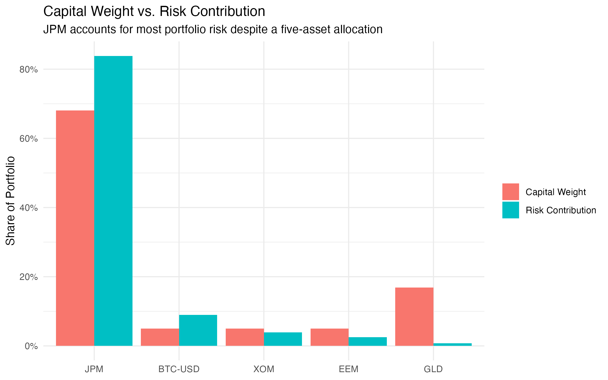
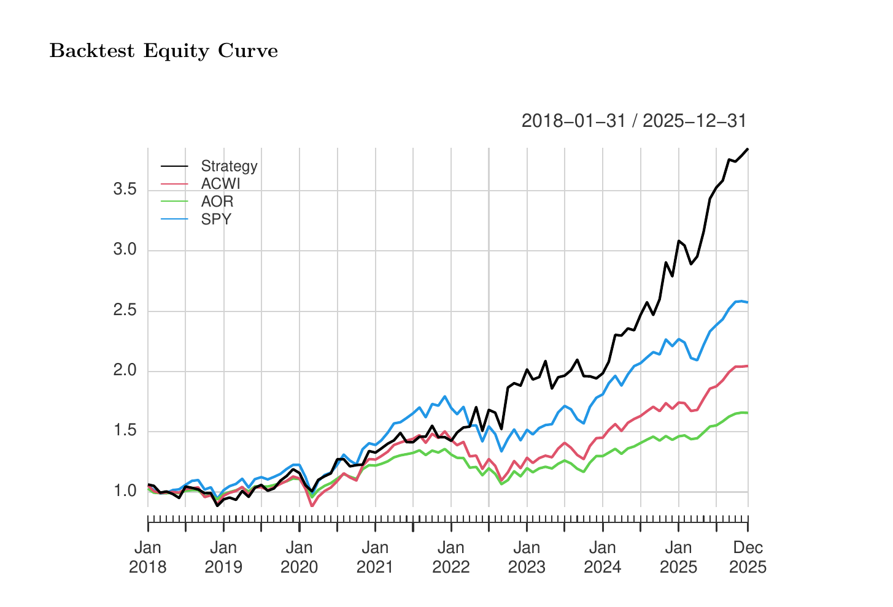

# Resilient Growth Opportunities Fund

### Multi-Asset Portfolio Strategy

A quantitative portfolio-construction project examining how constrained optimization, diversification, and risk attribution can be used to combine traditional and alternative assets.

The strategy allocates across U.S. financials, emerging markets, energy, gold, and Bitcoin, and evaluates historical performance relative to ACWI, AOR, and SPY.

## Strategy Overview

The portfolio was designed to pursue long-term growth while maintaining exposure to assets with different macroeconomic sensitivities. After standardizing the return methodology and fixing the sample at January 2016 through December 2025, the constrained static optimization produced the following allocation:

| Asset                                     | Portfolio Role                                   | Weight |
| ----------------------------------------- | ------------------------------------------------ | -----: |
| JPMorgan Chase (`JPM`)                    | Primary U.S. equity and cyclical-growth exposure | 68.10% |
| SPDR Gold Shares (`GLD`)                  | Defensive real-asset and diversification sleeve  | 16.90% |
| ExxonMobil (`XOM`)                        | Energy and commodity-cycle exposure              |  5.00% |
| iShares MSCI Emerging Markets ETF (`EEM`) | Geographic and emerging-markets diversification  |  5.00% |
| Bitcoin (`BTC-USD`)                       | Capped alternative-asset exposure                |  5.00% |

The portfolio is long-only and fully invested. Minimum allocations preserve exposure across the selected universe, while Bitcoin is capped at 5% to limit the effect of its substantially higher volatility.

## Risk Attribution

The allocation appears diversified across five holdings, but the underlying risk is highly concentrated. JPM represents 68.1% of invested capital and approximately 83.8% of estimated portfolio risk. Bitcoin contributes about 9.0% of risk despite its 5% allocation, while GLD represents 16.9% of capital but contributes less than 1% of estimated volatility.

## Historical Backtest

*Historical growth-of-$1 chart preserved from the original academic report. The archived report and source analysis are retained for transparency; corrected static optimization results are reported separately above.*

## Key Findings

**Historical optimization produced substantial concentration.** JPM received more than two-thirds of the corrected static allocation and accounted for an even larger share of estimated portfolio risk. Holding five assets did not create five independent sources of risk.

**Gold provided capital-efficient diversification.** GLD received 16.9% of capital but contributed relatively little to total portfolio volatility because of its lower volatility and covariance with the other holdings.

**A small Bitcoin allocation still mattered.** Despite its 5% cap, Bitcoin contributed approximately 9% of estimated portfolio risk, demonstrating how a high-volatility asset can materially affect portfolio behavior at a modest weight.

**The strategy is not a low-risk balanced portfolio.** It is better characterized as a concentrated, growth-oriented allocation with defensive and alternative sleeves.

## Analytical Framework

The project uses monthly market data from 2016 through 2025 and applies:

* Constrained mean-variance optimization
* Efficient-frontier analysis
* Benchmark comparison against ACWI, AOR, and SPY
* Maximum drawdown and downside-risk analysis
* Marginal and percentage contribution to portfolio risk
* Rolling return, volatility, and Sharpe-ratio analysis
* Rolling portfolio re-optimization
* CAPM regression
* Historical bootstrap scenarios
* Correlation and return-distribution diagnostics

## Investment Interpretation

The project illustrates both the usefulness and limitations of quantitative optimization.

Optimization provides a disciplined framework for combining assets and evaluating trade-offs, but the resulting portfolio remains sensitive to:

* Historical return and covariance estimates
* The selected asset universe
* Position constraints
* The chosen estimation window
* Concentration in individual securities
* The unusually strong historical performance of Bitcoin

The portfolio should therefore be evaluated through risk contribution, drawdowns, weight stability, and economic judgment—not only headline returns or Sharpe ratios.

## Repository Contents

* [`paper/final-paper.pdf`](paper/final-paper.pdf) — Full research paper and exhibits
* [`executive-summary.md`](executive-summary.md) — Concise investment-oriented summary
* [`archive/original-final.Rmd`](archive/original-final.Rmd) — Original executable R Markdown analysis
* [`data/README.md`](data/README.md) — Notes on data sources and availability

## Potential Extensions

Future development could include:

* Explicit maximum-position constraints
* Equal-weight, minimum-variance, and risk-parity comparisons
* Transaction costs and portfolio-turnover analysis
* Longer estimation windows and covariance shrinkage
* Walk-forward validation with explicitly lagged weights
* Broader exposure through diversified asset-class ETFs
* Historical regime and stress-period analysis

## Disclaimer

This project was developed for academic and professional portfolio purposes. Historical analysis is not a live investment track record, and the results should not be interpreted as investment advice or a recommendation to buy or sell any security.
